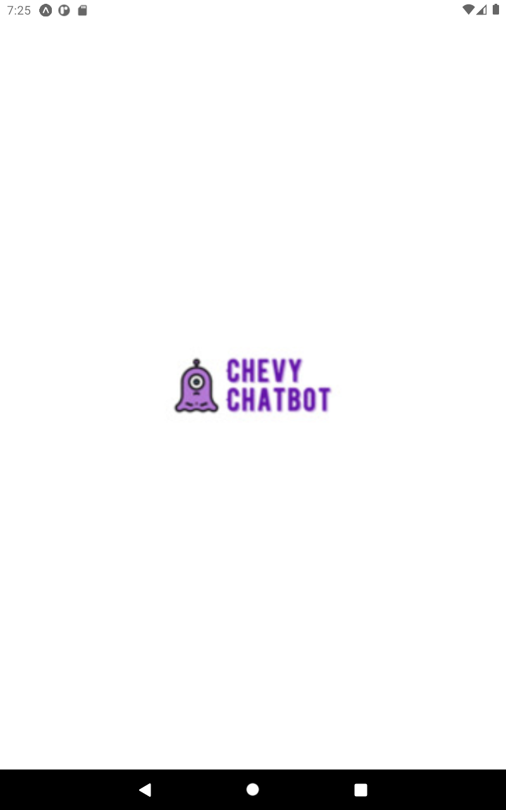
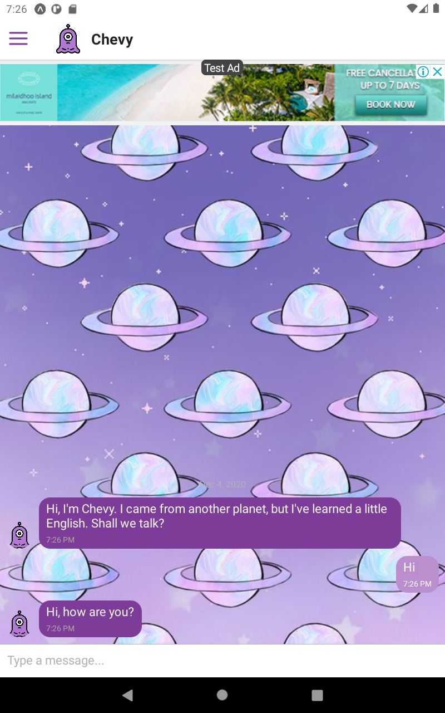
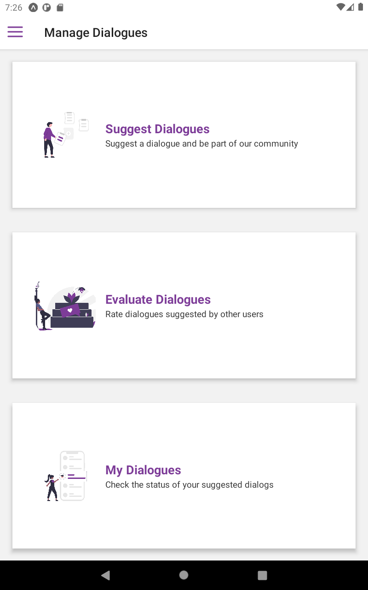

# Chevy Chatbot

  

<h3 align="center">
  The Chevy Chatbot aims to provide users with the possibility of conducting dialogues in English where the conversations and answers are registered and evaluated by the users themselves.
</h3>

  
  
  

  <a href="https://play.google.com/store/apps/details?id=com.knowledge.chevy"></img></a>

